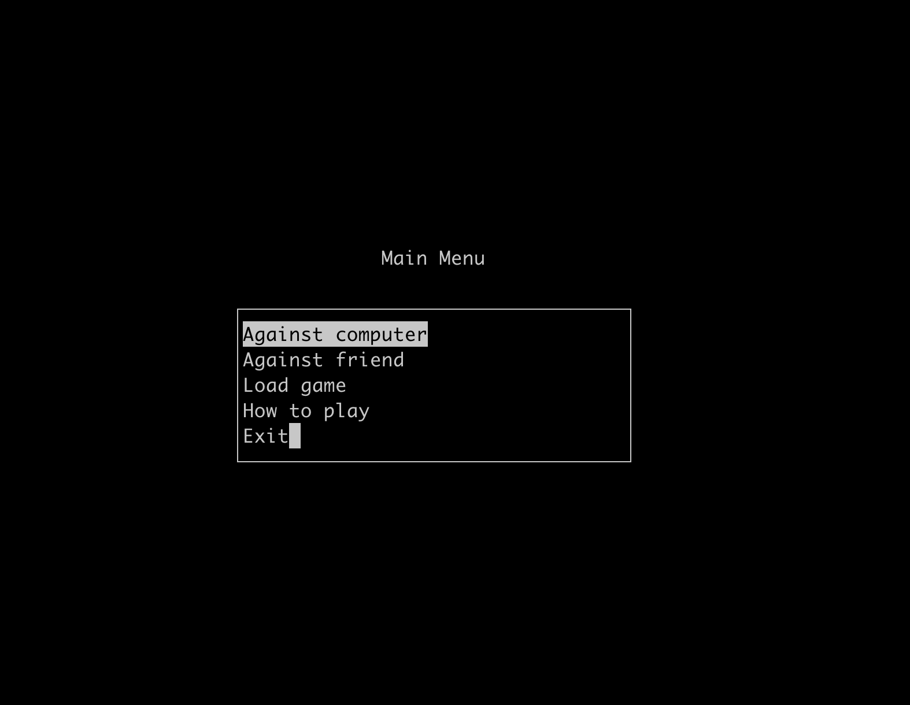
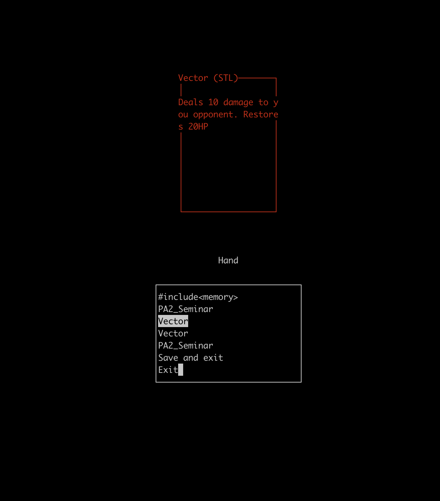
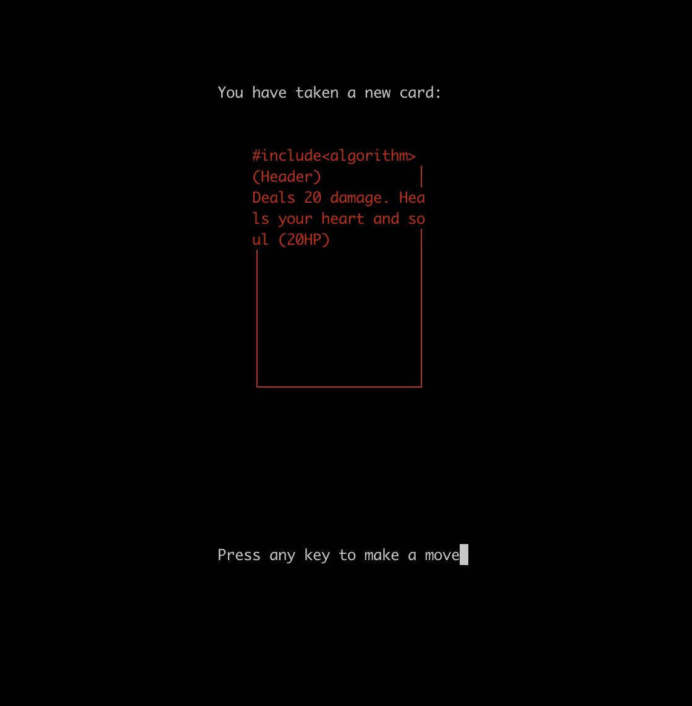
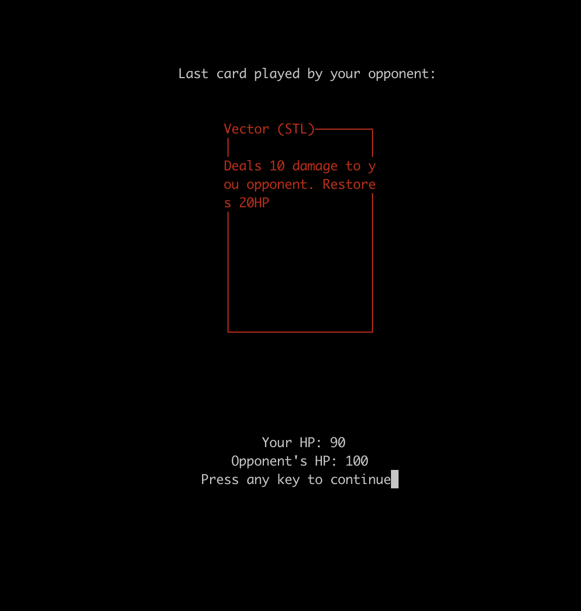

# PA2 Semester project 
## Card-Based RPG with ncurses

   

### Requirements
Your engine must:  
1. Load definition of cards (types, attributes, effects,...), deck (list of cards in deck) from file
2. Provide interface for creating a playing the game and implement following variants:   
   - player vs. computer (random moves are not sufficient)
   - player vs. player (blank confirmation window, opponent should not see our cards)  
3. Provides saving and loading running games  

### Deck format
The game supports user-defined decks of cards in the following format:
Each line represents exactly one card:  
`CARD_NAME CARD_DESCRIPTION CARD_SUIT CARD_DAMAGE CARD_HEALING CARD_TAKE CARD_RESTRICT`  
If you want to add a card multiple times, simply repeat the line representing it.  
`CARD_DAMAGE` is the damage dealt to your opponent when the card is played  
`CARD_HEALING` is the number of HP restored  
`CARD_TAKE` is the name of some card from a deck. You will receive a copy of this card.  
`CARD_RESTRICT` is the name of some suit that you will restrict your opponent from playing next turn.  

> All of your decks shall be stored in the *decks* directory.
> For better understanding, check *decks/Standard_Deck*.

The standard deck is university-themed and probably not very funny unless you study at CTU Prague.
However, all the UI examples in this README are based on that deck.

### Interface
The interface is made with ncurses. Thus, it's a GUI-like CLI that looks absolutely unusable when played on smaller screens or launched from non-expanded terminals.

#### Main menu
The main menu is just a list of options that looks as follows:  
  

The in-game menu is just your hand and a card-looking ncurses-box:  
  

When playing, you also see which cards you take each turn and the cards played by your opponent, as well as your HP:
